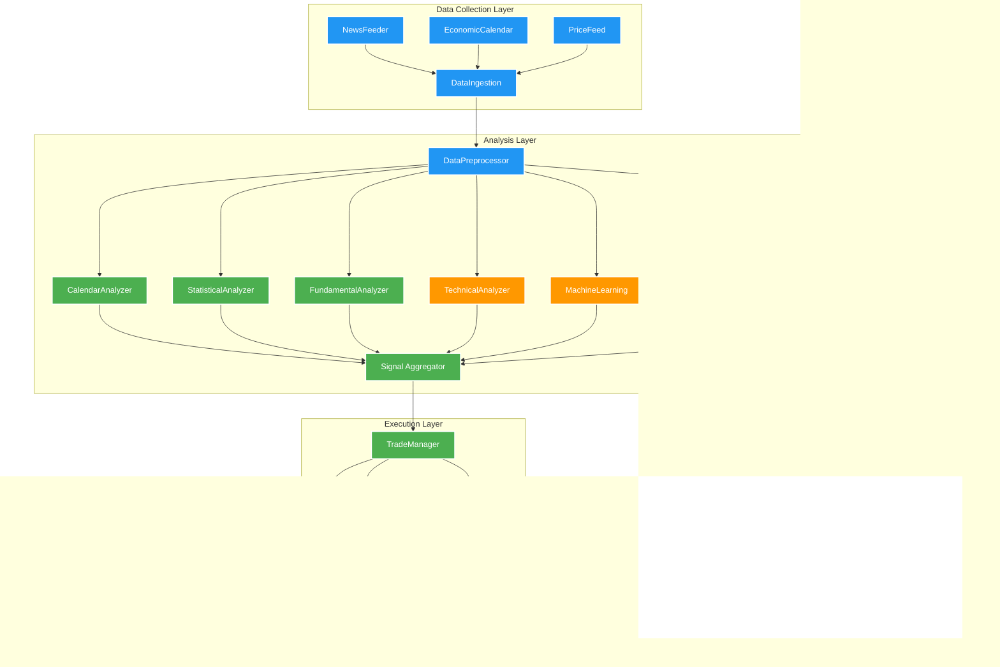

```mermaid
flowchart TD
    subgraph DataCollection["Data Collection Layer"]
        NF[NewsFeeder]
        EC[EconomicCalendar]
        PF[PriceFeed]
        
        NF --> DI[DataIngestion]
        EC --> DI
        PF --> DI
    end

    subgraph Analysis["Analysis Layer"]
        DI --> PP[DataPreprocessor]
        PP --> NA[NewsAnalyzer]
        PP --> CA[CalendarAnalyzer]
        
        %% New Quantitative Classes
        PP --> SA[StatisticalAnalyzer]
        PP --> FA[FundamentalAnalyzer]
        PP --> TA[TechnicalAnalyzer]
        PP --> ML[MachineLearning]
        
        subgraph LLMPipeline["LLM Analysis Pipeline"]
            style LLMPipeline fill:#ff9800,stroke:#fff
            IS[Initial Screening<br>Fast Model]
            DA[Detailed Analysis<br>Advanced Model]
            IS --> |High Impact| DA
        end
        
        NA --> LLMPipeline
        CA --> SG[Signal Aggregator]
        LLMPipeline --> SG
        
        %% Connect Quant outputs to Signal Aggregator
        SA --> SG
        FA --> SG
        TA --> SG
        ML --> SG
    end

    subgraph Execution["Execution Layer"]
        SG --> TM[TradeManager]
        TM --> MQ[MQL5 Interface]
        TM --> BT[Backtester]
    end

    subgraph Notification["Notification Layer"]
        TM --> AM[AlertManager]
        AM --> EM[EmailService]
        AM --> SM[SMSService]
        
        EM --> NS[NotificationStorage]
        SM --> NS
    end

    classDef dataPipeline fill:#2196f3,stroke:#fff,stroke-width:2px,color:#fff
    classDef analysis fill:#4caf50,stroke:#fff,stroke-width:2px,color:#fff
    classDef execution fill:#ff9800,stroke:#fff,stroke-width:2px,color:#fff
    
    class NF,EC,PF,DI,PP dataPipeline
    class NA,CA,IS,DA,SG,TM,BT,SA,FA analysis
    class MQ,AM,EM,SM,NS,TA,ML execution
```