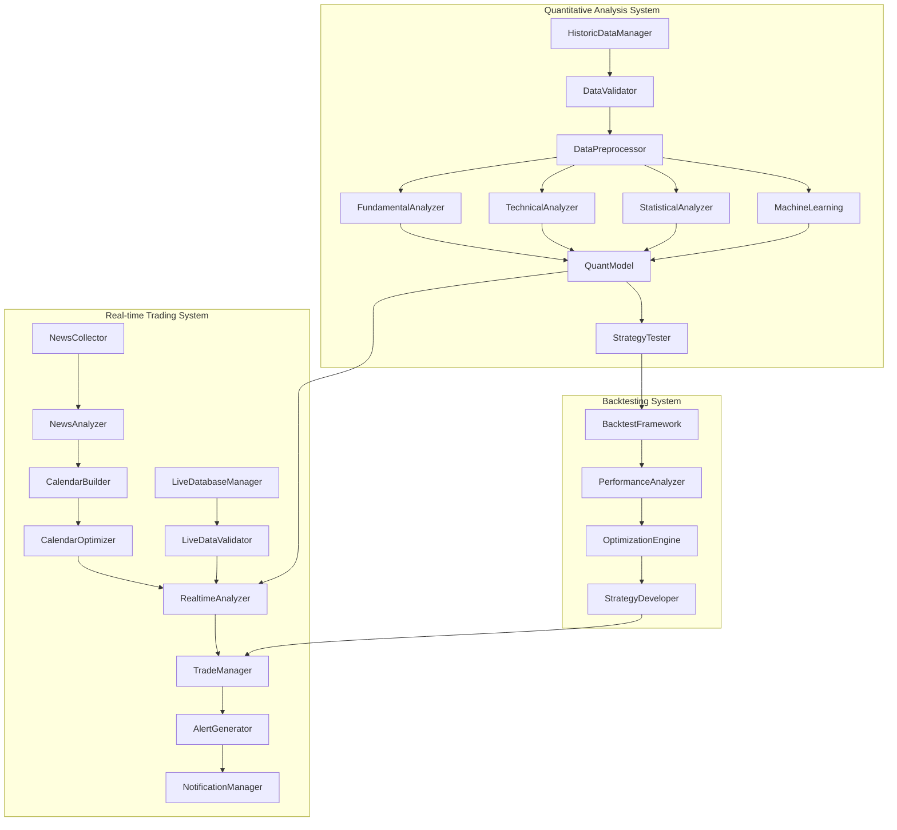

```mermaid
graph TD
    subgraph "Real-time Trading System"
        NC[NewsCollector] --> NA[NewsAnalyzer]
        NA --> CB[CalendarBuilder]
        CB --> CO[CalendarOptimizer]
        CO --> RTA[RealtimeAnalyzer]
        RTA --> TM[TradeManager]
        TM --> AG[AlertGenerator]
        AG --> NM[NotificationManager]
        DB1[LiveDatabaseManager] --> DV1[LiveDataValidator]
        DV1 --> RTA
    end

    subgraph "Quantitative Analysis System"
        HD[HistoricDataManager] --> DV2[DataValidator]
        DV2 --> DP[DataPreprocessor]
        DP --> FA[FundamentalAnalyzer]
        DP --> TA[TechnicalAnalyzer]
        DP --> SA[StatisticalAnalyzer]
        DP --> ML[MachineLearning]
        FA & TA & SA & ML --> QM[QuantModel]
        QM --> ST[StrategyTester]
    end

    subgraph "Backtesting System"
        ST --> BF[BacktestFramework]
        BF --> PA[PerformanceAnalyzer]
        PA --> OE[OptimizationEngine]
        OE --> SD[StrategyDeveloper]
    end

    SD --> TM
    QM --> RTA
```