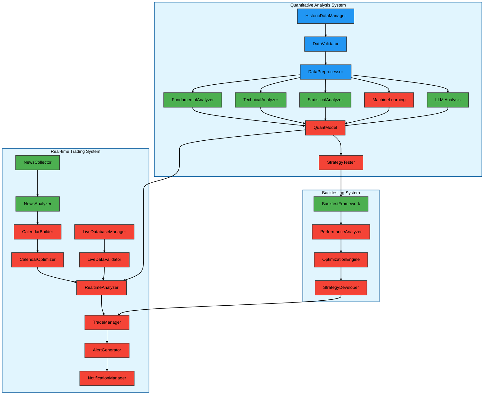

```mermaid
flowchart TD
    subgraph RTS["Real-time Trading System"]
        NC[NewsCollector]
        NA[NewsAnalyzer]
        CB[CalendarBuilder]
        CO[CalendarOptimizer]
        RTA[RealtimeAnalyzer]
        TM[TradeManager]
        AG[AlertGenerator]
        NM[NotificationManager]
        DB1[LiveDatabaseManager]
        DV1[LiveDataValidator]
        
        NC --> NA
        NA --> CB
        CB --> CO
        CO --> RTA
        RTA --> TM
        TM --> AG
        AG --> NM
        DB1 --> DV1
        DV1 --> RTA
    end

    subgraph QAS["Quantitative Analysis System"]
        HD[HistoricDataManager]
        DV2[DataValidator]
        DP[DataPreprocessor]
        FA[FundamentalAnalyzer]
        TA[TechnicalAnalyzer]
        SA[StatisticalAnalyzer]
        ML[MachineLearning]
        LA[LLM Analysis]
        QM[QuantModel]
        ST[StrategyTester]
        
        HD --> DV2
        DV2 --> DP
        DP --> FA & TA & SA & ML & LA
        FA & TA & SA & ML & LA --> QM
        QM --> ST
    end

    subgraph BTS["Backtesting System"]
        BF[BacktestFramework]
        PA[PerformanceAnalyzer]
        OE[OptimizationEngine]
        SD[StrategyDeveloper]
        
        ST --> BF
        BF --> PA
        PA --> OE
        OE --> SD
    end

    SD --> TM
    QM --> RTA

    classDef default fill:#f9f9f9,stroke:#333,stroke-width:2px;
    classDef system fill:#e1f5fe,stroke:#01579b,stroke-width:2px,color:#000;
    classDef finished fill:#2196f3,stroke:#333,stroke-width:2px,color:#000;
    classDef inProgress fill:#4caf50,stroke:#333,stroke-width:2px,color:#000;
    classDef initiated fill:#ff9800,stroke:#333,stroke-width:2px,color:#000;
    classDef notStarted fill:#f44336,stroke:#333,stroke-width:2px,color:#000;
    
    class RTS,QAS,BTS system;
    class HD,DV2,DP finished;
    class NC,NA,FA,TA,SA,LA,BF inProgress;
    class CB,CO,RTA,TM,AG,NM,DB1,DV1,ML,QM,ST,PA,OE,SD notStarted;

    linkStyle default stroke:#000,stroke-width:2px;
```