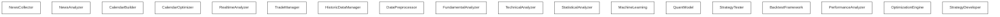

```mermaid
graph TD
    classDef blank fill:#ffffff,stroke:#000000
    classDef initiated fill:#ffe4b5,stroke:#000000
    classDef functional fill:#98fb98,stroke:#000000
    classDef complete fill:#228b22,stroke:#000000,color:#ffffff

    %% Real-time Trading System
    NC[NewsCollector]:::blank
    NA[NewsAnalyzer]:::blank
    CB[CalendarBuilder]:::blank
    CO[CalendarOptimizer]:::blank
    RTA[RealtimeAnalyzer]:::blank
    TM[TradeManager]:::blank

    %% Quantitative Analysis System
    HD[HistoricDataManager]:::blank
    DP[DataPreprocessor]:::blank
    FA[FundamentalAnalyzer]:::blank
    TA[TechnicalAnalyzer]:::blank
    SA[StatisticalAnalyzer]:::blank
    ML[MachineLearning]:::blank
    QM[QuantModel]:::blank

    %% Backtesting System
    ST[StrategyTester]:::blank
    BF[BacktestFramework]:::blank
    PA[PerformanceAnalyzer]:::blank
    OE[OptimizationEngine]:::blank
    SD[StrategyDeveloper]:::blank
```